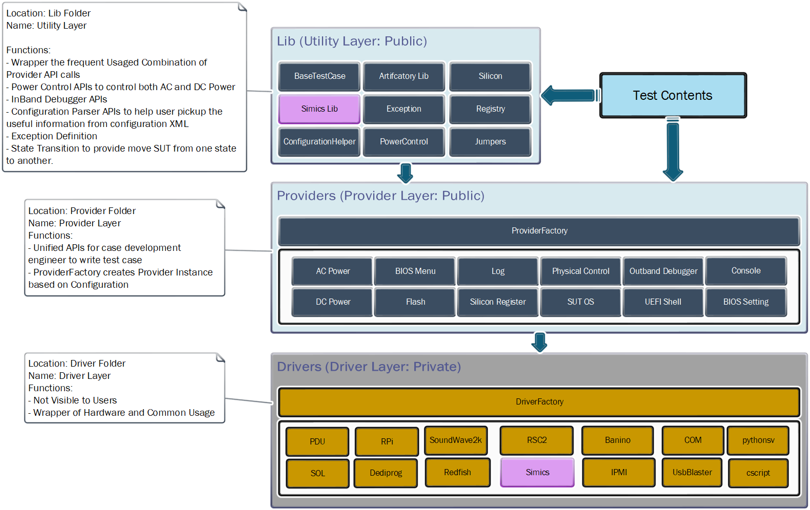

.. DPEA Test Automation Framework documentation master file, created by
   sphinx-quickstart on Fri Nov 22 11:01:34 2019.
   You can adapt this file completely to your liking, but it should at least
   contain the root `toctree` directive.

==============================
Welcome to DTAF documentation
==============================

-------------
Introduction
-------------
The purpose of this document is to describe the architectural and implementation details of DPEA Test Automation Framework (DTAF). This architecture is aligned across PIV for generating fully automated test content for Platform Integration teams, Platform Validation teams, and external customers.

Currently DPG primarily does Platform Validation and Platform Best Known Configuration (BKC) releases using manual test content execution.  As a result, content execution takes significant time, affecting overall validation coverage and release quality. DTAF architecture and associated processes aim to address these challenges.

DTAF has been architected to leverage a set of stable common interfaces (domain and core APIs) which help abstract the details of the environment, tools, and hardware in order to run the content virtually anywhere. The implementation of these Python based test content scripts provide the potential to reduce cycle time by 20 (based on data gathered from existing validation test cycles running on Purley-R reference platform)

DTAF architecture needs to address the following points, which are inherently existing in manual test execution:

   + **Scalability** of the tests across different families, derivatives, and execution environments
   + **Reusable test libraries** that can be shared across multiple tests
   + Provide **easy interface to control test flows and behavior**
   + **Automated test content development** through regression and continuous integration

--------------------
DTAF Core Structure
--------------------

---------
Contents
---------
.. toctree::
   :maxdepth: 1

   modules

----------------------
API Indices and Tables
----------------------

* :ref:`genindex`
* :ref:`modindex`
* :ref:`search`

-----
Links
-----
* `DTAF Architecture Wiki`_
* `Release on Artifactory`_
* `Release on Harbor`_

.. _`DTAF Architecture Wiki`: https://wiki.ith.intel.com/display/PEVDEVOPS/DTAF+Architecture+Reference+Document
.. _`Release on Artifactory`: https://af01p-png.devtools.intel.com/artifactory/webapp/#/artifacts/browse/tree/General/dtaf-framework-release-png-local
.. _`Release on Harbor`: https://amr-registry.caas.intel.com/harbor/projects/280/repositories